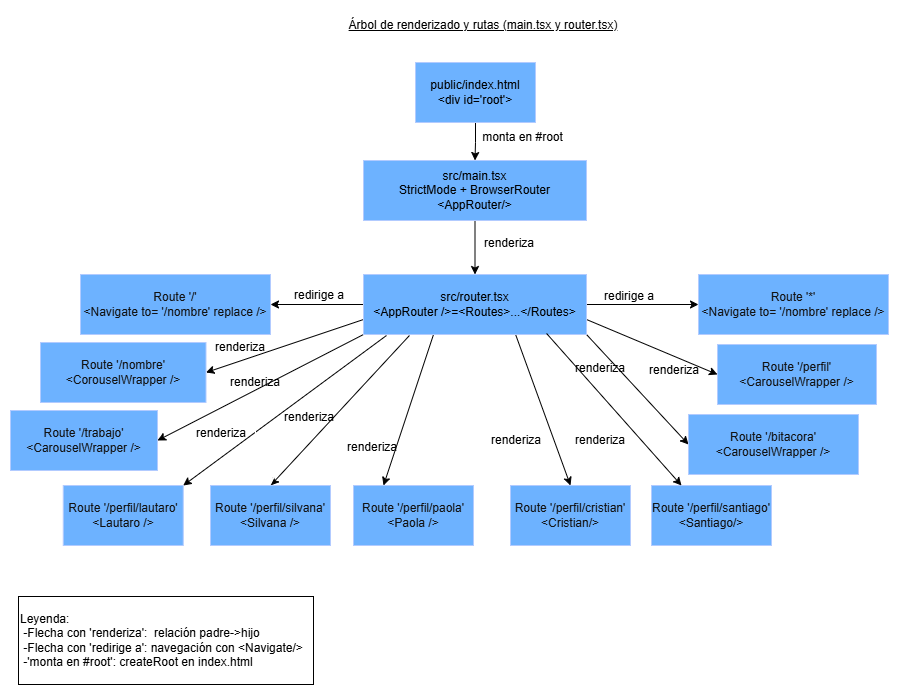
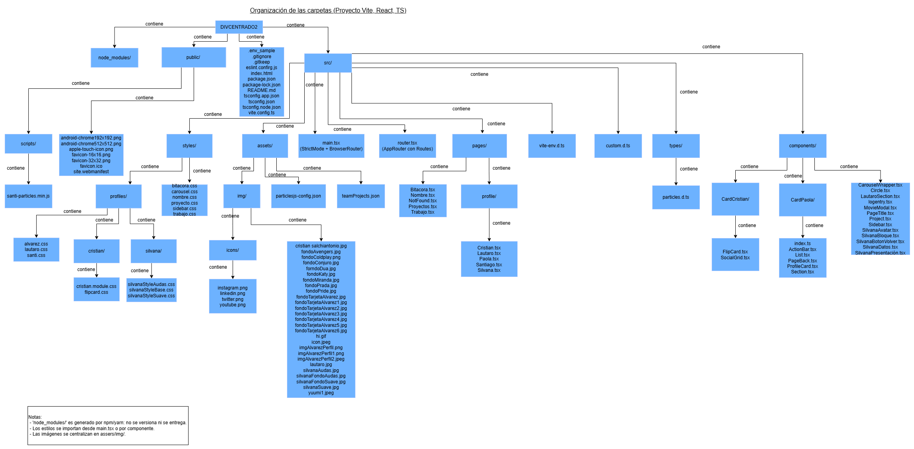
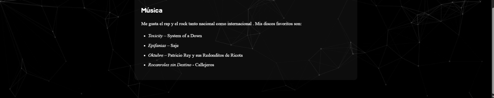
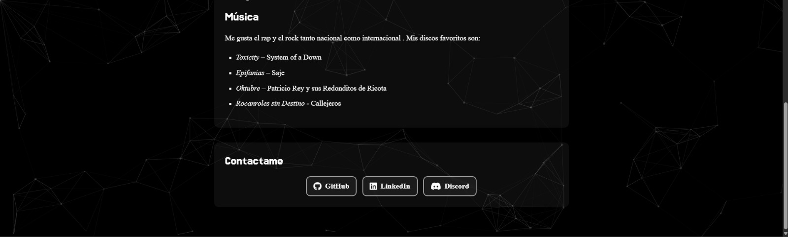
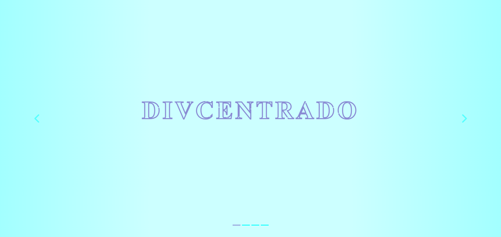
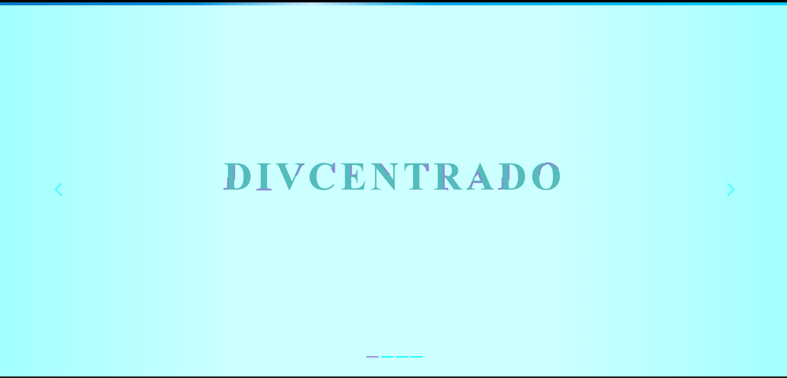
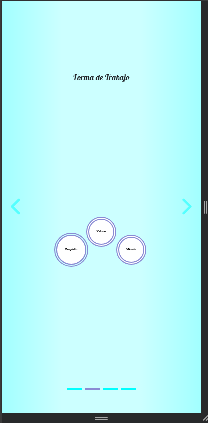
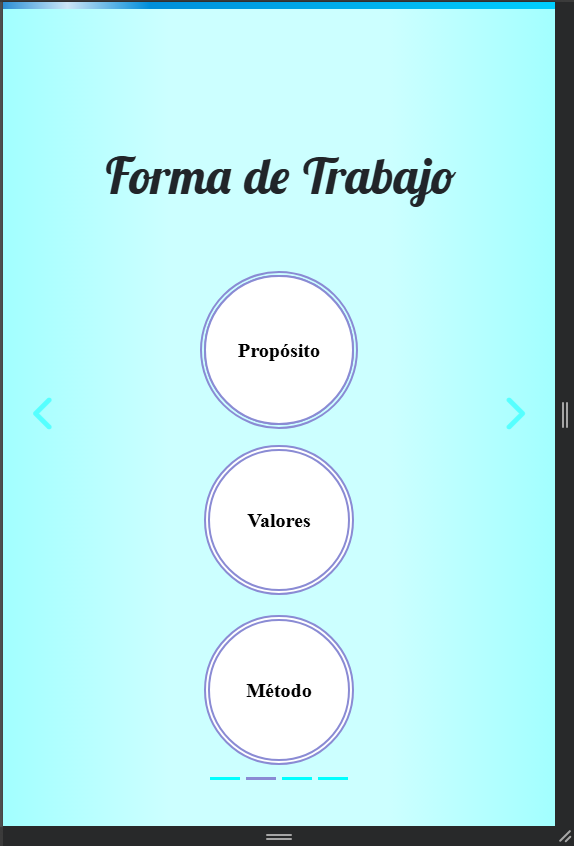
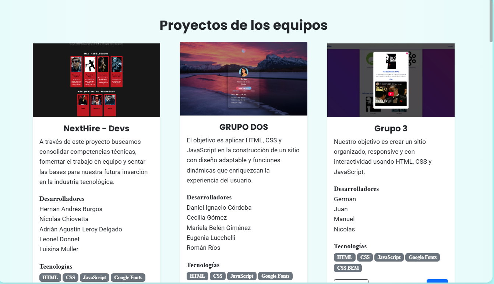
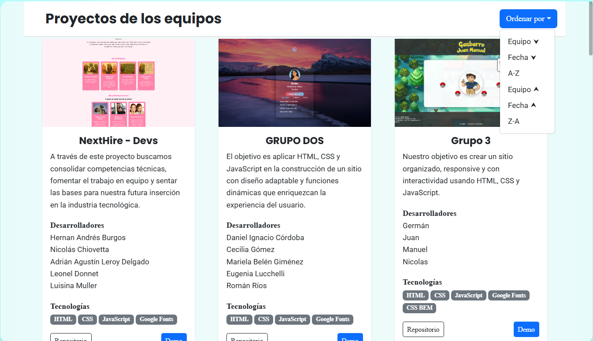

# 🖥️ DIVCENTRADO 💻


---

## 🚀 Proyecto Desplegado

Se hizo el deploy en Vercel con el siguiente link:
**[DIVCENTRADO](https://divcentrado3.vercel.app/)**

---

## 📄 Descripción

Se trata de una aplicación web frontend desarrollada en React, creada con el objetivo de darse a conocer profesionalmente y proyectarse hacia una futura inserción laboral en el sector IT.
La web funciona como una presentación personal y grupal, donde se muestra información detallada sobre cada integrante: quiénes son, cuáles son sus intereses, sus habilidades técnicas y personales, y las actividades que realizan en su tiempo libre. A través de una interfaz moderna e interactiva, el proyecto busca reflejar tanto el perfil profesional como el lado humano del equipo.
Este desarrollo no solo sirve como carta de presentación frente a empresas tecnológicas, sino también como una instancia de aprendizaje práctico, aplicando conocimientos de desarrollo frontend con React, diseño de interfaces y trabajo colaborativo.

---

## 🛠️ Tecnologías Utilizadas

* **Framework:** React 18+
* **Lenguaje:** TypeScript
* **Bundler:** Vite
* **Routing:** React Router DOM
* **Estilos:** Bootstrap 5 y CSS3
* **Animaciones:** TSParticles
* **Linting:** ESLint

---

## ⚙️ Instalación y Uso

### Prerrequisitos
* Node.js (versión 18 o superior)
* `npm` o `yarn`

### Pasos

1.  **Clonar el repositorio:**
    ```bash
    git clone https://github.com/LautaroColella/divcentrado2.git
    ```

2.  **Navegar al directorio del proyecto:**
    ```bash
    cd divcentrado2
    ```

3.  **Instalar dependencias:**
    ```bash
    npm install
    ```

4.  **Ejecutar en modo de desarrollo:**
    ```bash
    npm run dev
    ```
    La aplicación estará disponible en la URL `http://localhost:5173`

### Otros Scripts

* **Crear build de producción:**
    ```bash
    npm run build
    ```
* **Previsualizar el build:**
    ```bash
    npm run preview
    ```
* **Ejecutar el linter:**
    ```bash
    npm run lint
    ```

---

## ✨ Funcionalidades Implementadas

* **Carrusel Principal:** Componente `CarouselWrapper` que funciona como contenedor principal para navegar por las secciones.
* **Componentes Interactivos:**
    * **Circle:** Sistema de círculos con animaciones CSS (Flip, Ripple, Shrink) al hacer clic.
    * **Sidebar** Barra de navegación superior para redirigirse a cada perfil.
* **Perfiles Individuales:**
    * **Santiago:** Implementación de `TSParticles` con configuración dinámica para efectos de partículas.
    * **Lautaro** Se muestra un modal al hacer click en los botones de youtube.
    * **Cristian** Animación Flip al hacer click en las tarjetas.
    * **Paola** Cambio del fondo al hacer click en cambiar estilo, artistas o peliculas. Cambio de la foto de perfil al hacer click en cambiar foto.
    * **Silvana** Cambios en toda la página al hoverear sobre la foto.
* **Bitácora:** Sistema de logs y entradas para documentar el progreso.

---

## 📂 Estructura del Proyecto

```
src/
├── components/               # Componentes reutilizables principales
│   ├── CarouselWrapper.tsx   # Carrusel 
│   ├── logentry.tsx          # Log de cada bitácora
│   ├── Circle.tsx            # Círculos de la segunda slide
│   ├── MovieModal.tsx        # Modal con información de película (API)
│   └── PageTitle.tsx         # Titulo de cada página
│   └── Project.tsx           # Proyecto de cada estudiante (JSON)
│   └── Sidebar.tsx           # Quedaba mal una sidebar, es una navbar
├── pages/               # Páginas principales
│   ├── Bitacora.tsx     # Tercera slide con la bitácora
│   ├── Nombre.tsx       # Primer slide con el nombre del equipo
│   ├── NotFound.tsx     # Error 404 not found
│   ├── Proyectos.tsx    # Proyectos de los estudiantes
│   ├── Trabajo.tsx      # Segunda slide donde se ve la forma de trabajo
│   └── profile/         # Páginas de perfiles individuales
│       ├── Cristian.tsx
│       ├── Lautaro.tsx
│       ├── Paola.tsx
│       ├── Santiago.tsx
│       └── Silvana.tsx
├── styles/              # Hojas de estilo CSS
│   ├── profiles/        # Estilos específicos de perfiles
│   ├── bitacora.css
│   ├── carousel.css
│   ├── nombre.css
│   ├── sidebar.css
│   ├── proyecto.css
│   └── trabajo.css
├── assets/             # Recursos multimedia
│   └── img/            # Imágenes y iconos
├── types/              # Definiciones de tipos TypeScript
├── main.tsx           # Punto de entrada de la aplicación
└── router.tsx         # Configuración de rutas
```
---

## 🌳 Diagrama de arbol de renderizado 




## Estructura de Archivos 

 

---

## Redes antes 


Decidimos como complemento agregar botones que lleven a un medio de contacto como linkedin, Github o discord (ejemplo en pagina de Santiago) 




## 🆕 Redes Despues


---

## SideBar antes
Nos dimos cuenta que le faltaba algun tipo de indentificador para la sidebar ya que no se veia, asi que decidimos agregar una barra para que se vea



## 🆕 SideBar Despues



---

## MediaQuery Antes

Se ajustaron los media query para que se tenga una mejor vista en Mobile 



## 🆕 MediaQuery Despues



---

## Equipos antes

Se realizo una mejora en la zona de Proyectos de los equipos, agregando un boton 'ORDENAR POR' que filtra los proyectos por fecha, nombre o equipo



## 🆕 Equipos Despues


